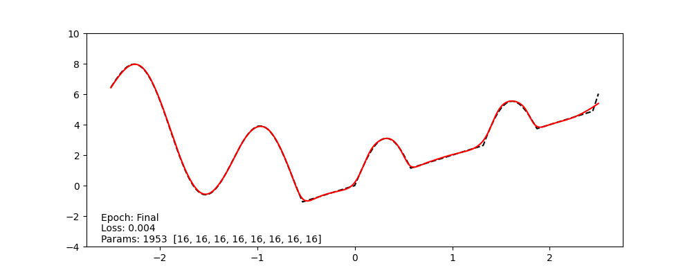

# Neural Network 1D Function Approximation

A simple PyTorch project for learning the basics of neural networks and dataloaders by approximating a complex non-linear function.

<div align="center">
    
    <p><em>Visualization of neural network (red) approximating our target function (black dashed)</em></p>
</div align="center">


## Overview

This project demonstrates how neural networks can learn to approximate complex non-linear functions. It uses a custom dataset representing the function:

```
y = max(2x, 3sin(5x) + x²)  where x ∈ [-2.5, 2.5]
```

The project serves as an educational tool for understanding:
- How to create custom datasets in PyTorch
- Basic neural network architecture and design in PyTorch
- Training loops
- Effect of activation functions and model width/depth on learning performance

## Project Components

### Dataset
`SimpleCurveData`: A custom PyTorch dataset that:
- Generates points from our target function
- Creates arbitrary amounts of training data
- Eliminates estimation error (since we know the ground truth)

### Model
`FeedForwardNetwork`: A modular neural network implementation with:
- Configurable hidden layer widths and depths
- Customizable activation functions
- Parameter counting functionality

### Training & Visualization
- Training loop with configurable optimization settings
- Live plotting to visualize model convergence
- Loss tracking and reporting

## Features

- **Configurable Network Architecture**: Easily experiment with different network depths, widths, and activation functions
- **Visualization**: Plot the true function alongside network predictions to see learning progress
- **Parameter Counting**: Track the total number of parameters in your model
- **Modern PyTorch Practices**: Uses PyTorch's built-in modules for data loading and network construction

## Results

The optimal configuration achieved a loss < 0.005 with:
- 8 layers of width 16 each (~2,000 parameters)
- Mish activation function
- 100 epochs of training
- Exponential learning rate decay

## Usage

1. Clone the repository
2. Install the required dependencies: `pip install -r ../requirements.txt`
4. Run the training script: `python MNIST_CNN.py`

### Configuration

Edit the `main` function to experiment with:

```python
w = 16                                                                      # Width of hidden layers
d = 8                                                                       # Number of layers
layer_widths = [w] * d
model = FeedForwardNetwork(1, layer_widths, 1, activation=nn.Mish)          # Activation function
```

Edit the `train` function to experiment with:

```python
optimizer = torch.optim.Adam(model.parameters(), lr=0.004)                  # Optimizer
scheduler = torch.optim.lr_scheduler.ExponentialLR(optimizer, gamma=0.99)   # Learning rate scheduler
```